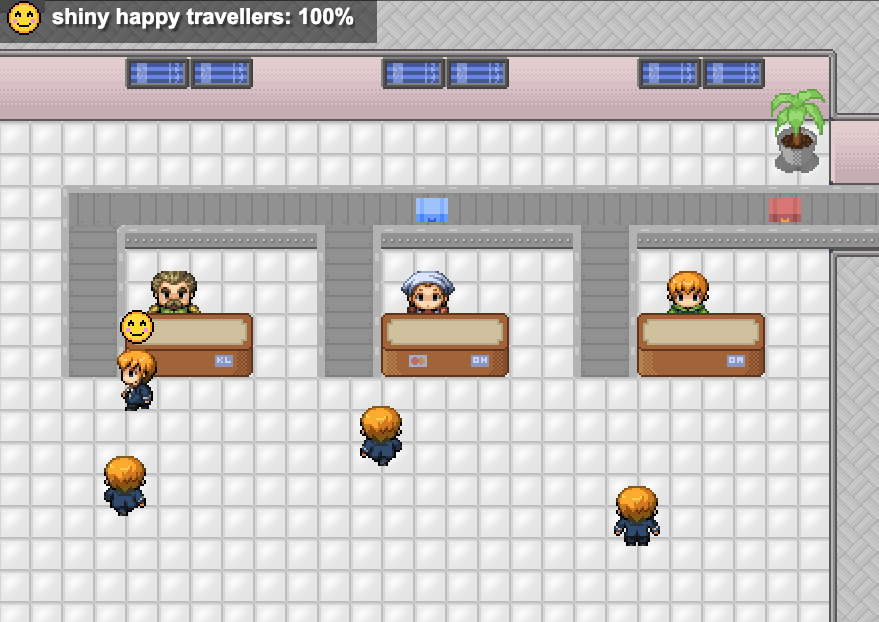

# Airport Mesh

Airport Mesh is a sample project for Service Fabric Mesh. It visualizes features such as scaling out services, attaching volumes and intelligent routing using a game-like UI built using phaser.io.



Credits to [Silveira Neto](http://silveiraneto.net/2011/08/20/getting-openpixels/) and Pineda for almost all pixel art.

## Prerequisites

This sample project requires an Azure Storage account with the following set up:

1. An Azure Storage file share.
2. An Azure Storage queue named 'passportcheckrequests'.
3. An Azure Storage blob container named 'passportcheckresults'.

## Running locally

Set the following environment variables:

- AIRPORTMESH_STORAGE_ACCOUNT_NAME = *\<name of your Azure Storage account>*
- AIRPORTMESH_STORAGE_ACCOUNT_KEY = *\<key of your Azure Storage account>*

Start the back-end services by running Docker Compose Up:

```
docker-compose -f "src/docker-compose.yml" up -d --build
```

The front-end is designed to be run locally. Start it in development mode to connect to the local back-end services (from the /src folder):

```
npm run start:dev
```

The front-end will be available at `http://localhost:8080`.

## Deploying to Service Fabric Mesh

You can use the ARM templates in the /deployment folder to deploy the back-end services to Service Fabric Mesh. Example:
```
az mesh deployment create --template-file ./deployment/service-fabric-mesh.json --parameters "{\"location\": {\"value\": \"westeurope\"}, \"fileShareName\": {\"value\": \"YOUR_FILE_SHARE_NAME\"}, \"storageAccountName\": {\"value\": \"YOUR_STORAGE_ACCOUNT_NAME\"}, \"storageAccountKey\": {\"value\": \"YOUR_STORAGE_ACCOUNT_KEY\"}}"
```

Set the following environment variable locally on your machine to point the front-end to the Mesh application:

- AIRPORTMESH_MESH_IP = *\<IP adres of the Mesh application>*

The front-end is designed to be run locally. Start it in production mode to connect to the deployed back-end services on Service Fabric Mesh:

```
npm start
```

## Sort-O-Tron

The Sort-O-Tron(TM) routes luggage to one of two conveyor belts. By default, it will route all luggage to belt `0`. You can change this behaviour by adding a `sort-instructions.json` file:

```
{
    "KL": 0,
    "OW": 1,
    "OA": 0
}
```

In the example above, all luggage for airlines `KL` and `OA` (the blue and green suitcases respectively) will be routed to belt `0`. Luggage for airline `OW` (the red suitcases) will be routed to belt `1`.

If you're running locally, place the file in a `~/SortOTron/` folder. If you're running on Service Fabric Mesh, upload the file to the file share in Azure Storage.

## How to use the front-end

- `left` and `right` arrows: scroll
- `space`: pause
- `1`: send a package to conveyor belt `0`
- `2`: send a package to conveyor belt `1`
- `9`: send a suspicious package to conveyor belt `0`
- `0`: send a suspicious package to conveyor belt `1`
